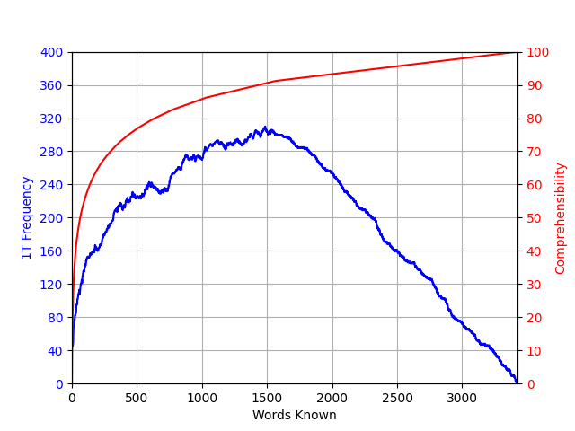

# Empyrical

> Gathering empirical data on the process of immersion learning.

Empyrical is a small Python package that mines empirical data from text corpora to help language learners reason about the immersion-learning process. It ships a CLI (`empyrical`) with three analyses today, sharing a common spaCy-based preprocessing pipeline.

| Analysis | Question it answers |
|---|---|
| **`hill1t`**  | At each step of learning a frequency list, how many *1T sentences* (sentences with exactly one unknown lemma) are available, and how comprehensible is the corpus? |
| **`coverage`** | If I learn the top-N most frequent lemmas, what fraction of all token occurrences do I understand? |
| **`mine`**    | Given a vocabulary I already know, *which actual sentences* in this corpus have exactly one unknown lemma? |
| **`anki-import`** | Extract your known-word list from an Anki `.apkg` so it can feed `mine --known`. |



## Installation

```sh
py -m venv venv
./venv/scripts/activate
pip install -e .[dev]
python -m spacy download en_core_web_sm
```

The spaCy model is intentionally separate from `pip install` — pinning it as a wheel URL breaks on every spaCy release. Pick the [model you want](https://spacy.io/models/) for your target language.

## Quickstart

The repo ships a sample lemma cache, [`examples/parsed.txt`](examples/parsed.txt) (1332 sentences from a small news corpus). You can run every analysis against it without supplying any text or running spaCy:

```sh
empyrical hill1t   --parsed examples/parsed.txt --out-png hill1t.png
empyrical coverage --parsed examples/parsed.txt --out-png coverage.png
empyrical mine     --parsed examples/parsed.txt --top-n 500 --max 20
```

## Usage

### `empyrical hill1t`

```sh
empyrical hill1t ./resources --out-csv hill1t.csv --out-png hill1t.png
```

Dual-axis plot of 1T-sentence count and cumulative comprehensibility as the learner moves through the frequency list. CSV columns: `words_known,count_1t,comprehensibility_pct`.

### `empyrical coverage`

```sh
empyrical coverage ./resources --out-csv coverage.csv
```

Cumulative token coverage curve. CSV columns: `rank,coverage_fraction`. The final entry is always 1.0.

### `empyrical mine`

```sh
# Treat the top 500 most-frequent lemmas as known
empyrical mine ./resources --top-n 500 --max 50 --out-jsonl mine.jsonl

# Or supply your own known-word list (one lemma per line)
empyrical mine ./resources --known my_vocab.txt --out-jsonl mine.jsonl
```

Each output line is a JSON object: `{"unknown": "...", "sentence": ["...", "..."]}`.

### `empyrical anki-import`

Turn an Anki `.apkg` into a flat known-word list you can feed to `mine --known`.

```sh
empyrical anki-import mydeck.apkg -o known.txt --status mature --field Word
empyrical mine ./resources --known known.txt --out-jsonl mine.jsonl
```

Flags:

- `apkg` (positional) — the Anki deck export. **Important:** when exporting from Anki, check **"Include scheduling information"** or the importer can't tell which cards are known.
- `-o / --out PATH` — output path for the word list (UTF-8, one word per line, sorted).
- `--status {mature,young,review,learning,all}` — which cards count as known. Default `mature` matches Anki's own definition (review cards with interval ≥ 21 days). Suspended cards are always excluded except under `all`.
- `--field NAME` — note field holding the target word (default `Word`). The importer maps field names per note-type, so mixed-type decks work.

### Shared flags

Every subcommand accepts:

- `text_path` (positional) — directory of `.txt` files to analyze. Optional when `--parsed` is used.
- `--spacy-pipeline NAME` — spaCy pipeline to use (default `en_core_web_sm`).
- `--parsed PATH` — load pre-lemmatized JSON cache and skip spaCy.
- `--save-parsed PATH` — after running spaCy, dump the lemma list to a JSON cache for reuse.

For any sizeable corpus, run once with `--save-parsed cache.json` and then use `--parsed cache.json` for all subsequent experiments.

## Development

```sh
pip install -e .[dev]
pytest
```

Tests run on hand-built fixture data and do not require spaCy or any model download.

## Release History

* 0.1.0 — Package restructure, CLI, coverage + mine analyses, perf-rewritten 1T counter, pytest suite.
* 0.0.1 — Initial Hill1t script.

## Contributing

1. Fork it (<https://github.com/refold-languages/community-projects/fork>)
2. Create your feature branch (`git checkout -b feature/fooBar`)
3. Commit your changes (`git commit -am 'Add some fooBar'`)
4. Push to the branch (`git push origin feature/fooBar`)
5. Create a new Pull Request
